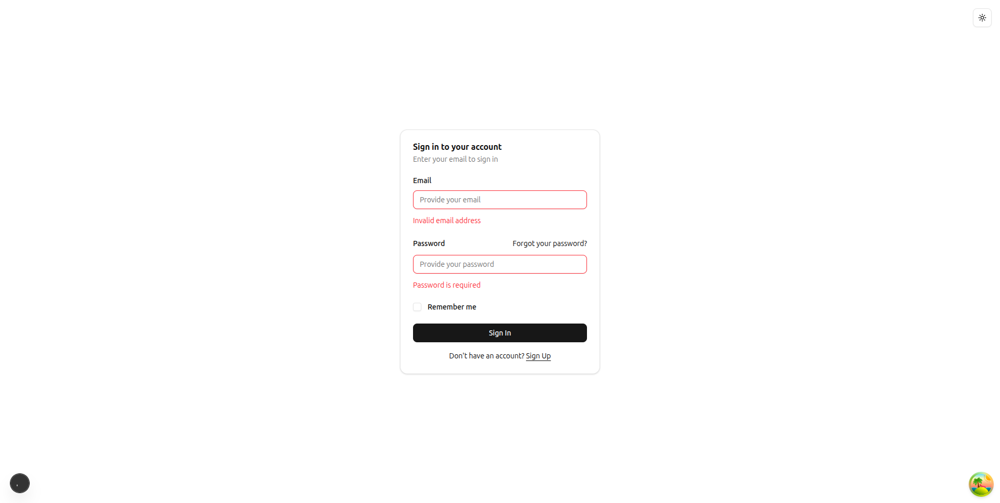
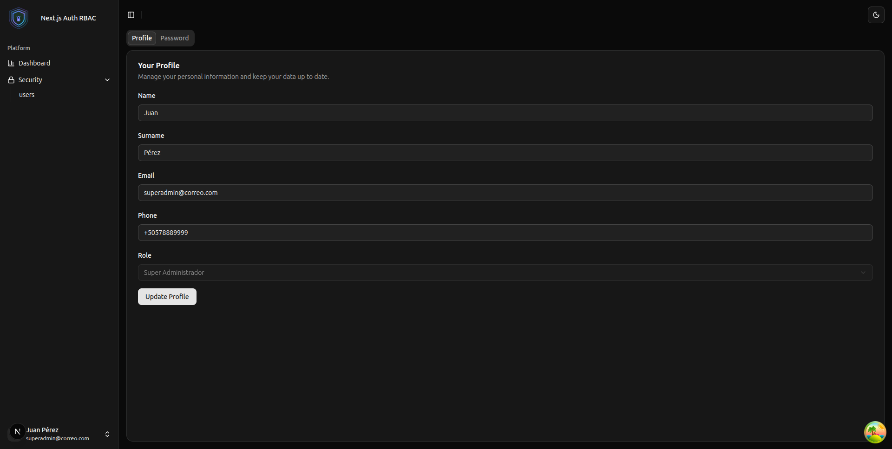
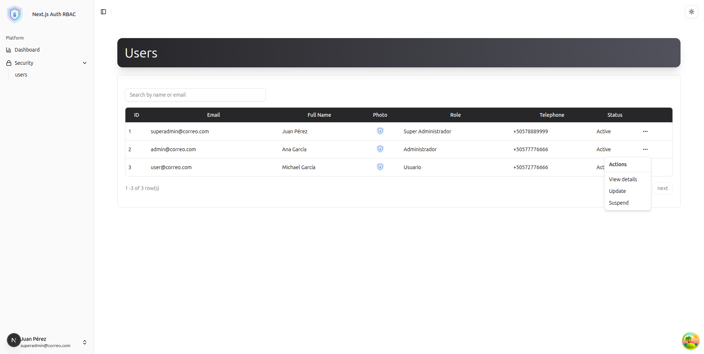
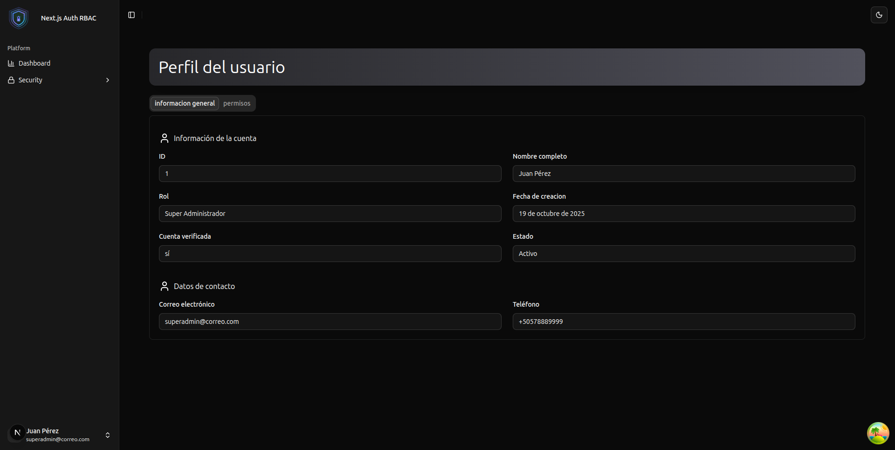

# nextjs-auth-rbac

This project is a **boilerplate/template** built with **Next.js 15**, designed for applications that require **authentication**, **permission management**, **user settings**, and full **internationalization (i18n)** support.

It integrates with a **NestJS** backend that implements role- and permission-based authentication.  
🔗 Backend repository: [nest-auth-rbac](https://github.com/Antonio-Conrado/nest-auth-rbac)

---

## 🛠 Key Technologies

- **Next.js 15** (App Router)
- **TypeScript**
- **TailwindCSS + Shadcn UI** (reusable and styled components)
- **Zustand** (global state management)
- **Zod** (schema and form validation)
- **Axios + TanStack Query** (request handling, caching, and synchronization)
- **Next Intl** (frontend internationalization)
- **Sonner** (notifications and alerts)

---

## 📦 Modular Architecture

The project follows a **modular structure** to facilitate scalability and maintainability:

- **app/**  
  Routes defined using Next.js 15 App Router:

  - Public routes: `/login`, `/register`, `/forgot-password`, `/verify-email`, `/reset-password`
  - Protected routes: `/dashboard`, `/profile`, `/settings`

- **features/**  
  Independent modules (e.g., auth, profile, settings), each with:

  - Components
  - Hooks
  - Schemas (Zod)
  - Server Actions

- **lib/**  
  Reusable configurations and utilities:

  - Axios instance with token interceptors
  - Helpers, constants, and common functions
  - `hasPermission` function for controlling visibility based on user permissions

- **locales/**  
  Translation files organized by language (`en`, `es`) compatible with Next Intl.

- **providers/**  
  Global providers:

  - `QueryProvider` (TanStack Query with DevTools)
  - `AuthProvider` (session and token management)

- **shared/**  
  Shared resources across the application:

  - UI components (Shadcn-based)
  - Generic hooks
  - Reusable validation schemas

- **store/**  
  Contains the application's global state logic using **Zustand**, where shared state, settings, and reusable stores are defined.

---

## 🔐 Authentication and Authorization

- **Route protection middleware:**  
  Redirects unauthenticated users to `/login` and blocks access to public routes if already logged in.

- **Permission control:**  
   The function `hasPermission(permissionKey: string)` allows showing or hiding components or actions based on user permissions (fetched from the backend).

- Using `hasPermission`
  You can conditionally render UI elements based on user permissions using the `hasPermission` function:

```
    {hasPermission('user.update') && (
    <button className="btn-primary">Update User</button>
    )}
```

- **Token management:**
  - **Access Token:** used in every authenticated request.
  - **Refresh Token and Remember Token:** automatically renewed via AuthProvider.
  - Support for persistent sessions (`remember me`).

---

## 🌍 Internationalization (i18n)

- Implemented using **Next Intl**.
- Default language configurable in `.env`:

```env
NEXT_PUBLIC_DEFAULT_LOCALE=es  # 'es' for Spanish, 'en' for English
```

---

## 🖼 Screenshots

### Login Page



### Profile



### users Page

## 

### user Page

## 

## Getting Started

1. Clone this repository:

   ```bash
       git clone https://github.com/Antonio-Conrado/nextjs-auth-rbac.git
   ```

2. Navigate to the project folder:

   ```bash
      cd nextjs-auth-rbac
   ```

3. Install the dependencies:

   ```bash
      npm i
   ```

4. Create a `.env` file in the root directory by copying the template and updating the values with your own:

   ```bash
      cp .env.template .env
   ```

5. To run the standard development server:

```bash
   npm run dev
```
